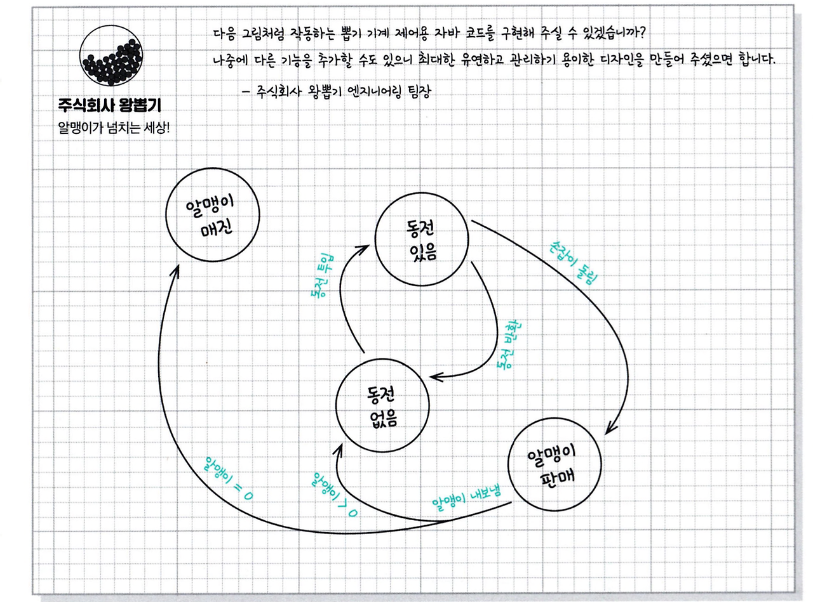

# State Pattern
뽑기 회사에서 다음과 같은 식으로 작동하는 뽑기 기계 컨트롤러용 코드 구현 요청이 들어 왔다.

* 동그라미는 상태를 나타낸다.
* 화살표는 상태의 전환을 의미한다.  

위 이미지에서 상태 (or 행동)은 총 네개이나, 살질적으론 다섯개이다.
* 동전 투입
* 동전 반환
* 손잡이 돌림
* 알맹이 내보냄: 알맹이 판매에서 조건에 따라
  * 알맹이 매진
  * 동전 없음  

이를 배경으로 뽑기 기계를 만들어 보자
```kotlin
class GumballMachine(
  count: Int,
) {
  companion object {
    val SOLD_OUT = 0
    val NO_QUARTER = 1
    val HAS_QUATER = 2
    val SOLD = 3
  }

  private var count: Int = count
  private var state = SOLD_OUT

  init {
    if (count > 0) {
      state = NO_QUARTER
    }
  }

  // 동전 투입
  fun insertQuarter() {
    when (state) {
      HAS_QUATER -> println("동전은 한 개만 넣어 주세요.")
      NO_QUARTER -> {
        state = HAS_QUATER
        println("동전을 넣으셨습니다.")
      }
      SOLD_OUT -> {
        println("매진되었습니다. 다음 기회에 이용해주세요.")
      }
      SOLD -> {
        println("잠깐만 기다려 주세요. 알맹이가 나가고 있습니다. ")
      }
    }
  }

  // 동전 반환
  fun ejectQuarter() {
    when (state) {
      HAS_QUATER -> {
        println("동전이 반환됩니다.")
        state = NO_QUARTER
      }
      NO_QUARTER -> {
        println("동전을 넣어주세요")
      }
      SOLD_OUT -> {
        println("동전을 넣지 않으셨습니다. 동전이 반환되지 않습니다. ")
      }
      SOLD -> {
        println("이미 알맹이를 뽑으셨습니다.")
      }
    }
  }

  // 손잡이 돌리기
  fun turnCrank() {
    when (state) {
      HAS_QUATER -> {
        println("손잡이를 돌리셨습니다.")
        state = SOLD
        dispense()
      }
      NO_QUARTER -> {
        println("동전을 넣어주세요.")
      }
      SOLD_OUT -> {
        println("매진되었습니다.")
      }
      SOLD -> {
        println("손잡이는 한 번만 돌려주세요.")
      }
    }
  }

  // 알맹이 꺼내기 
  fun dispense() {
    when (state) {
      HAS_QUATER -> {
        println("알맹이가 나갈 수 없습니다.")
      }
      NO_QUARTER -> {
        println("동전을 넣어주세요.")
      }
      SOLD_OUT -> {
        println("매진입니다.")
      }
      SOLD -> {
        println("알맹이가 나가고 있습니다.")
        count -= 1
        state = if (count == 0) {
          println("더 이상 알맹이가 없습니다.")
          SOLD_OUT
        } else {
          NO_QUARTER
        }
      }
    }
  }

}
```
이렇게 코드가 잘 돌아가고 있었으나, 또 다른 요청사항이 들어 왔다. 바로 10분의 1확률로 손잡이를 돌릴 떄 알맹이 두개가 나오도록 고쳐야 하는 것이다.  
이 요구사항에 맞출수 있도록 새롭게 디자인 해보자.
1. 우선 뽑기 기계와 관련된 모든 행동에 대한 메소드가 들어있는 State 인터페이스를 정의하자.
2. 그 다음에 기계의 모든 상태에 대해 상태 클래스를 구혀하자. 기계가 어떤 상태에 있다면, 그 상태에 해당하는 클래스가 모든 작업을 책임져야 한다. 
3. 마지막으로 조건문 코드를 전부 없애고, 상태 클래스에 모든 작업을 위임하자.

```kotlin
interface State {
    fun insertQuarter()
    fun ejectQuarter()
    fun turnCrank()
    fun dispense()
}

class NoQuarterState(
  val gumballMachine: GumballMachine,
): State {
  override fun insertQuarter() {
    println("동전을 넣으셨습니다.")
    gumballMachine.changeState(gumballMachine.hasQuarterState)
  }

  override fun ejectQuarter() {
    println("동전을 넣어주세요")
  }

  override fun turnCrank() {
    println("동전을 넣어주세요.")
  }

  override fun dispense() {
    println("동전을 넣어주세요.")
  }
}

class HasQuarterState(
  val gumballMachine: GumballMachine
): State{
  override fun insertQuarter() {
    println("동전은 한 개만 넣어 주세요.")
  }

  override fun ejectQuarter() {
    println("동전이 반환됩니다.")
    gumballMachine.changeState(gumballMachine.noQuarterState)
  }

  override fun turnCrank() {
    println("손잡이를 돌리셨습니다.")
    gumballMachine.changeState(gumballMachine.soldState)
  }

  override fun dispense() {
    println("알맹이가 나갈 수 없습니다.")
  }
}

class SoldState(
  private val gumballMachine: GumballMachine
): State {
  override fun insertQuarter() {
    println("잠깐만 기다려 주세요. 알맹이가 나가고 있습니다. ")
  }

  override fun ejectQuarter() {
    println("이미 알맹이를 뽑으셨습니다.")
  }

  override fun turnCrank() {
    println("손잡이는 한 번만 돌려주세요.")
  }

  override fun dispense() {
    gumballMachine.releaseBall()
    if (gumballMachine.count > 0) {
      gumballMachine.changeState(gumballMachine.noQuarterState)
    } else {
      println("Oops, out of gumballs!")
      gumballMachine.changeState(gumballMachine.soldOutState)
    }
  }
}

class SoldOutState(
  val gumballMachine: GumballMachine
): State{
  override fun insertQuarter() {
    println("매진되었습니다. 다음 기회에 이용해주세요.")

  }

  override fun ejectQuarter() {
    println("동전을 넣지 않으셨습니다. 동전이 반환되지 않습니다. ")
  }

  override fun turnCrank() {
    println("매진되었습니다.")
  }

  override fun dispense() {
    println("매진입니다.")
  }
}

class GumballMachine(
  numberGumballs: Int,
) {
  val soldOutState = SoldOutState(this)
  val noQuarterState = NoQuarterState(this)
  val hasQuarterState = HasQuarterState(this)
  val soldState = SoldState(this)
  val winnerState = WinnerState(this)

  private var state: State = soldOutState
  var count = numberGumballs
    protected set

  init {
    if (numberGumballs > 0) {
      this.state = noQuarterState
    }
  }

  fun insertQuarter() {
    state.insertQuarter()
  }

  fun ejectQuarter() {
    state.ejectQuarter()
  }

  fun turnCrank() {
    state.turnCrank()
    state.dispense()
  }

  fun dispense() {
    state.dispense()
  }

  fun changeState(state: State) {
    this.state = state
  }

  fun releaseBall() {
    println("A gumball comes rolling out this slot...")
    if (count != 0) {
      count -= 1
    }
  }
}
```
이때까지 한 일을 정리해 보자.
* 각 상태의 행동을 별개의 클래스로 국지화 시켰다.
* 관리하기 힘든 골칫덩어리 if 선언문들을 없앴다.
* 각 상태를 변경에 대해서는 닫혀있도록 하면서도 GumballMachine 자체는 새로운 상태 클래스를 추가하는 확정애 대헤서 열려있도록 고쳤다.
* 더 이해하기 좋은 코드 베이스와 클래스 구조를 만들었다.  

이렇게 우리가 한 일이 바로 스테이트 패턴이다. 

> **스테이트 패턴**을 이용하면 객체의 내부 상태가 바뀜에 따라서 객체의 행동을 바꿀 수 있다. 마치 객체의 클래스가 바뀌는 것과 같은 결과를 얻을 수 있다.  

## 스테이트 패턴 vs 스트레티지 패턴
스테이트 패턴과 스트레티지 패턴은 매우 비슷해 보인다. 둘은 어떤 차이가 있을까?  
**스테이트 패턴은**
* 상태 객체에 일련의 행동이 캡슐화 된다. 
* 상황에 따라 Context 객체에서 여러 상태 객체 중 한 객체에 모든 행동을 맡기게 됨
* 그 객체의 내부 상태에 따라 현재 상태를 나타내는 객체가 바뀌게 되고 그 결과로 컨텍스트 객체의 행동도 자연스럽게 바뀜
* 클라이언트는 상태 객체에 대해서 거의 몰라도 됨

즉,
* 컨텍스트 객체에 수많은 조건문을 집어 넣는 대신에 사용할 수 있는 패턴이라고 생각하면 됨

**스트레티지 패턴은**
* 일반적으로 클라이언트에서 컨텍스트 객체에게 어떤 전략을 사용할지 지정해줌
* 주로 실행시에 전략 객체를 변경할 수 있는 유연성을 제공
* 가장 적합한 전략 객체를 선택해서 사용

즉,
* 서브클래스를 만드는 방법을 대신해 유연성을 극대화하기 위한 용도로 쓰임
* 상속을 이용해 클래스의 행동을 정의하다보면 행동을 마음대로 변경하기가 쉽지 않은데, 스트래티지를 통해 유연성 있게 변경 가능

## 공짜 알맹이 당첨 기능 추가
```kotlin
class WinnerState(
    val gumballMachine: GumballMachine,
): State {
    override fun insertQuarter() {
        throw UnsupportedOperationException()
    }

    override fun ejectQuarter() {
        throw UnsupportedOperationException()
    }

    override fun turnCrank() {
        throw UnsupportedOperationException()
    }

    override fun dispense() {
        println("축하드립니다! 알맹이를 하나 더 받으실 수 있습니다.")
        gumballMachine.releaseBall()
        if (gumballMachine.count == 0) {
            gumballMachine.changeState(gumballMachine.soldOutState)
        } else {
            println("더 이상 알맹이가 없습니다.")
            gumballMachine.changeState(gumballMachine.soldOutState)
        }
    }
}

class GumballMachine(
  numberGumballs: Int,
) {
  // ...
  val winnerState = WinnerState(this)
}

class HasQuarterState(
  val gumballMachine: GumballMachine
): State {

  val randomWinner = Random(System.currentTimeMillis())

  // ...

  override fun turnCrank() {
    println("손잡이를 돌리셨습니다.")
    val winner = randomWinner.nextInt(10)
    if (winner == 0 && gumballMachine.count > 1) {
      gumballMachine.changeState(gumballMachine.winnerState)
    } else {
      gumballMachine.changeState(gumballMachine.soldState)
    }
  }
  
  // ...
}
```


